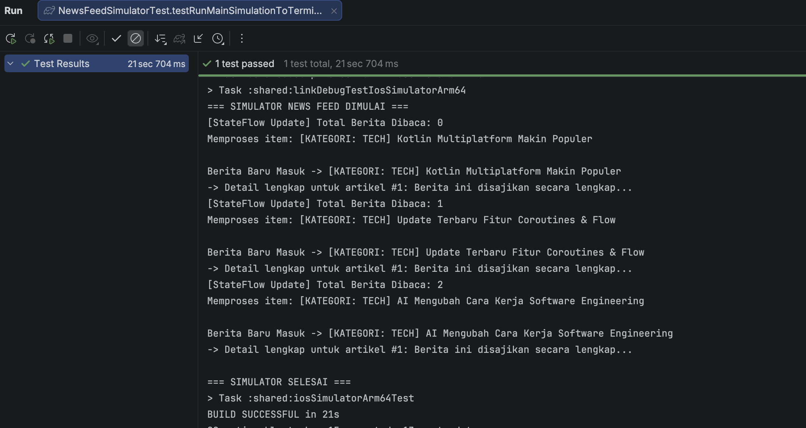
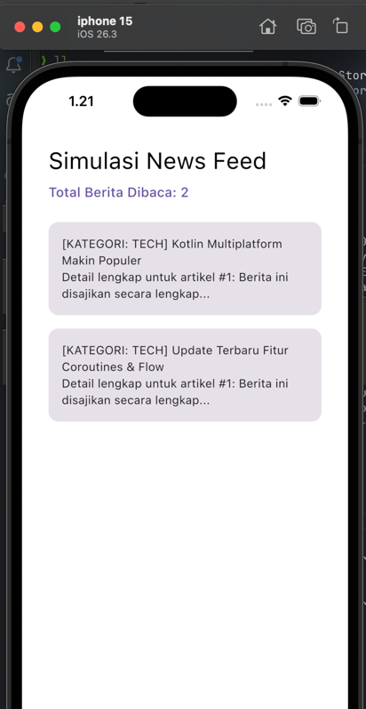
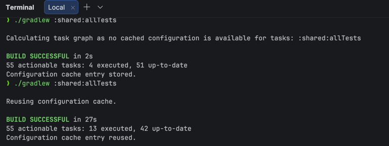

# News Feed Simulator 

Daniel Calvin Simanjuntak
123140004
PAM RA

Tugas untuk mengimplementasikan coroutines pada kasus News Feed Simulator. Berikut adalah penjelasan mengenai implementasi yang dilakukan:

## Fitur dan Komponen Utama (Sesuai Kriteria Rubrik)

1. **Implementasi Flow**
   - **File:** `shared/src/commonMain/kotlin/NewsFeedSimulator.kt`
   - **Keterangan:** Menggunakan `flow { ... }` builder untuk membuat aliran data secara asinkron. Data dipancarkan (menggunakan `emit`) setiap 2 detik menggunakan fungsi suspend `delay(2000L)`. Aliran data ini kemudian ditarik secara terus-menerus menggunakan `collect`.

2. **Penggunaan Operators**
   - **File:** `shared/src/commonMain/kotlin/NewsFeedSimulator.kt` & `App.kt`
   - **Keterangan:** 
     - `.filter`: Menyaring berita agar hanya meneruskan berita dengan kategori tertentu (contoh: "Tech").
     - `.map`: Melakukan transformasi pada objek berita mentah menjadi sebuah *string* atau format judul yang rapi sebelum disajikan ke UI.
     - `.onEach`: Memberikan efek samping berupa *logging* setiap kali sebuah data masuk ke tahap tersebut tanpa mengubah bentuk datanya.
     - `.catch`: Sebagai *Error Handling* jika sewaktu-waktu terjadi pengecualian (*exception*) saat stream berlangsung.

3. **StateFlow Implementation**
   - **File:** `shared/src/commonMain/kotlin/NewsFeedSimulator.kt`
   - **Keterangan:** Proyek menggunakan `MutableStateFlow` (melalui variabel internal `_readCount`) dan terekspos secara *read-only* sebagai `StateFlow` (`readCount`). `StateFlow` ini digunakan untuk me-manajemen nilai jumlah total berita yang telah terbaca dan men-trigger pembaruan pada UI secara reaktif ketika fungsi `markAsRead()` dipanggil.

4. **Coroutines Usage**
   - **File:** `shared/src/commonMain/kotlin/NewsFeedSimulator.kt` & `App.kt`
   - **Keterangan:** Menggunakan eksekusi coroutine asinkron. Pengambilan detail berita mensimulasikan *network fetch* melalui coroutine *suspend* dengan pengaturan thread via `withContext(Dispatchers.Default)`. Pada saat mengambil nilainya, kode memanggil fungsi `async { ... }` yang berjalan paralel lalu mendapatkan nilainya dengan `.await()`.

---

## Cara Menjalankan Aplikasi

Ada tiga cara utama untuk melihat dan menguji proyek ini:

### 1. Menjalankan Simulasi Output Teks (Terminal)
Karena ini adalah proyek *Multiplatform* (tanpa target JVM standalone),untuk melihat output `println()` secara real-time di terminal IDE adalah:
1. Buka file `shared/src/commonTest/kotlin/NewsFeedSimulatorTest.kt`.
2. Cari fungsi `testRunMainSimulationToTerminal()`.
3. Klik tombol **Play (Segitiga Hijau)** di samping fungsi tersebut melalui Android Studio/Inntellij IDEA.
4. simulasi *News Feed* mencetak output tiap 2 detik langsung di tab *Run* (Console).



### 2. Menjalankan Tampilan Aplikasi (UI Jetpack Compose)
berjalan dengan antarmuka (UI) visual pada Emulator/HP:
1. Buka IDE yang mendukung.
2. Di bagian atas layar, ubah konfigurasi *Run* ke modul aplikasi (biasanya bernama **`androidApp`** atau **`composeApp`**).
3. Pilih target *Device* (Misal: Emulator Android).
4. Klik **Run** (Play). Daftar berita akan muncul satu per satu dengan animasi secara visual di layar, dan total bacaan akan selalu ter-update.


### 3. Menjalankan Unit Test Penuh (Validasi Otomatis)
Untuk menjalankan semua rangkaian test yang memvalidasi keakuratan StateFlow dan eksekusi Flow:
- Buka panel *Terminal* dan ketik perintah berikut:
  ```bash
  ./gradlew :shared:allTests
  ```
- *Catatan: Test memanfaatkan module `kotlinx-coroutines-test` yang akan "mem-bypass" virtual time, sehingga meskipun kita menaruh delay 2 detik, tes tetap akan lolos dalam sekejap hitungan milidetik.*
- 