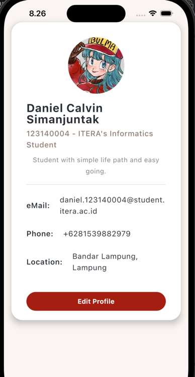

# My Profile App

Daniel Calvin Simanjuntak
123140004

## Cara Kerja Aplikasi

Aplikasi ini menggunakan arsitektur UI deklaratif dari Jetpack Compose / Compose Multiplatform. Seluruh antarmuka dikonstruksi secara dinamis dengan menyatukan beberapa bagian kecil UI. Titik masuk utama UI berada di dalam file `App.kt` (berada di modul `shared`), di mana halaman profil dirakit secara komposisi (composition) menggunakan fungsi-fungsi (Composable) yang lebih kecil dan terisolasi.

## Penerapan Composable Function (Reusable)

Untuk menghindari penumpukan kode dan meningkatkan keterbacaan, UI dipecah menjadi 3 *composable functions* utama yang bisa digunakan berulang-ulang:

### 1. `ProfileCard`
Komponen ini berfungsi sebagai wadah utama (pembungkus) untuk konten profil pengguna.
- **Penerapan**: Komponen ini menerima parameter berupa blok *content* (`@Composable () -> Unit`). Hal ini memungkinkan `ProfileCard` dapat digunakan di halaman lain dengan isi yang berbeda, selama masih membutuhkan gaya latar berupa kartu.
- **Komponen UI**: Menggunakan komponen `Card` untuk memberikan latar belakang putih, sudut yang membulat (rounded corners), dan efek melayang (elevation), yang di dalamnya membungkus sebuah `Column`.

### 2. `ProfileHeader`
Komponen ini bertugas menampilkan blok identitas pengguna, termasuk foto, nama, bio profesi, dan deskripsi tentang mereka.
- **Penerapan**: Dibuat agar menerima parameter `name`, `bio`, `description`, dan `imageRes` secara dinamis. Anda dapat menggunakan komponen ini berkali-kali untuk user A, user B, dan seterusnya, hanya dengan mengirim nilai parameter yang berbeda.
- **Komponen UI**:
  - `Column`: Menyusun elemen secara vertikal dari atas (foto) hingga ke bawah (deskripsi).
  - `Box`: Digunakan untuk membungkus `Image` guna menjaga presisi ukuran (120x120 dp).
  - `Image`: Menampilkan foto pengguna yang diatur agar berbentuk lingkaran penuh dengan modifier `clip(CircleShape)`.
  - `Text`: Merender susunan tipografi dengan *font size* dan *font weight* yang bervariasi.

### 3. `InfoItem`
Komponen ini bertugas merender satu baris informasi detail kontak atau lokasi.
- **Penerapan**: Mengingat email, telepon, dan lokasi memiliki pola struktur UI yang persis sama, fungsi ini dipanggil sebanyak 3 kali (reusable). Fungsi ini menerima `iconText` dan `text`.
- **Komponen UI**:
  - `Row`: Menyusun ikon di sebelah kiri, lalu memberikan jarak (Spacer), dan teks informasi ditaruh di sebelah kanannya (tata letak horizontal).
  - `Text`: Digunakan baik untuk merender teks info maupun merender simbol/emotikon sebagai pengganti *Vector Icon*.

## Penggunaan Komponen Dasar Compose

Berikut adalah rincian singkat komponen dasar yang minimal digunakan dalam proyek ini:

- **Column**: Komponen tata letak (layout) utama untuk menyusun elemen anak dari atas ke bawah. Ditemukan pada root `App`, `ProfileCard`, dan `ProfileHeader`.
- **Row**: Komponen tata letak untuk menyusun elemen berjejer ke samping (horizontal). Ditemukan dalam `InfoItem`.
- **Box**: Komponen fleksibel yang bisa merender *child* saling menumpuk. Digunakan di `ProfileHeader` untuk mengelola gambar profil.
- **Card**: Komponen bergaya *Material Design* berbentuk kartu dengan efek bayangan dan sudut tumpul di `ProfileCard`.
- **Text**: Merupakan komponen penampil teks utama. Digunakan untuk merender nama, deskripsi, informasi, tulisan pada tombol, dan juga emotikon profil.
- **Button**: Diterapkan di bagian bawah halaman sebagai antarmuka interaktif yang dapat diklik pengguna (Contoh: "Edit Profile").
- **Image/Icon**: 
  - `Image` digunakan menggunakan `painterResource` untuk membaca file gambar dan menampilkannya sebagai avatar bundar. 
  - *Icon* digantikan perannya oleh simbol berbasis karakter (di dalam komponen Text) agar tetap elegan namun tidak memerlukan konfigurasi *dependency* yang kompleks (bebas eror `Unresolved reference`).

## Cara Menjalankan

Aplikasi ini dapat dijalankan menggunakan Android Studio (karena dibuat menggunakan KMP).
1. Buka *Project* di Android Studio.
2. Di bagian menu atas konfigurasi lari, pilih modul `androidApp`.
3. Tekan **Run** (Ikon Segitiga Hijau) atau jalankan melalui terminal:
   ```bash
   ./gradlew assembleDebug
   ```

## Screenshots
